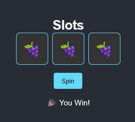

# Slot Machine Web App

This project is a simple slot machine game built using HTML, CSS, and JavaScript. The app serves as a practice project for front-end web development skills, allowing users to spin three icons with random symbols and displays a message if all three symbols match.


<div align="center">
  
</div>

## Features
- **Random Symbol Generation**: Each reel displays a random symbol from a predefined set.
- **Spin Button**: A button allows users to spin the icons.
- **Win Detection**: Displays a message if all three symbols match, otherwise prompts to "Try Again".
- **Animation**: Icons spin with a simple animation effect.

## Technology Stack
- HTML: Provides the structure for the slot machine game.
- CSS: Styles the layout and animations.
- JavaScript: Handles the logic for spinning the icons, generating random symbols, and checking win conditions.

## How to Run
To run the project locally:
1. Clone the repository:
    ```bash
    git clone https://github.com/zanemilo/slot-machine-web-app
    cd slot-machine
    ```
2. Open the `index.html` file in your web browser.

## Future Development Plans
### Enhancements & UI Improvements
- Add sound effects for spinning reels and win notifications.
- Implement a scoring system to track user winnings.
- Optimize the game for mobile and tablet devices.
- Implement reel animations.

### Advanced Features
- Introduce a virtual currency system with betting options.
- Add user authentication to save scores.
- Deploy the app using platforms like GitHub Pages or Netlify.

## Known Issues
- **Spinning Animation Bug**: The Spin button can be spammed allowing user to rapid cycle through spins, which interrupts the animation.
  - Planned fix: Adjust JavaScript logic to make the button 'toggle-able' via boolean variable.

## License
This project is open-source and available under the MIT License.

## Contact
For questions or suggestions, feel free to reach out via my GitHub: [zanemilo](https://github.com/zanemilo).
